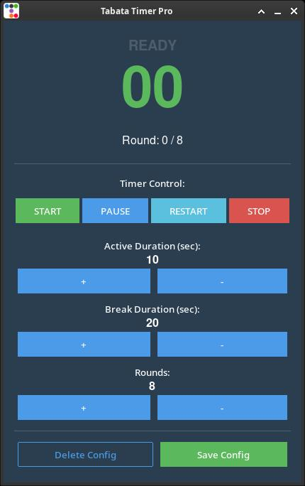

# Tabata Desktop App


## 🎯 Overview
**Tabata Desktop App** is a high-precision, configurable timing tool designed for practitioners of the Tabata protocol. Developed in Python 3.11, this application provides a robust and minimalist interface to manage High-Intensity Interval Training (HIIT) sessions directly from your desktop.

* **Author:** Marco Baturan
* **Date:** April 2026
* **License:** Creative Commons Zero (CC0)
* **Warranty:** None (Provided "as is")

## 🖼️ Interface


## 🔬 Scientific Foundation
The Tabata protocol is a specialized form of HIIT characterized by 20 seconds of ultra-high-intensity exercise followed by 10 seconds of rest, repeated for 8 cycles. This application allows full customization of these intervals while maintaining the structural integrity required for optimal cardiovascular results.

### References & Scientific Evidence
* **[Original Study (1996)]**: [The foundational research by Dr. Izumi Tabata](https://pubmed.ncbi.nlm.nih.gov/8897392/) - Published in *Medicine & Science in Sports & Exercise*.
* **[HIIT & Metabolism]**: [High-Intensity Intermittent Training and Fat Loss](https://www.ncbi.nlm.nih.gov/pmc/articles/PMC2991639/) - A review of metabolic impact.
* **[Mayo Clinic]**: [Interval training for greater fitness](https://www.mayoclinic.org/healthy-lifestyle/fitness/in-depth/interval-training/art-20044588) - Practical guidance on HIIT.

## ⚙️ Installation
This application is optimized for **Python 3.11.2**. Compatibility with other versions has not been verified.

### Modern Installation (via UV)
[UV](https://github.com/astral-sh/uv) is the recommended package manager for this project:
```bash
# Sync dependencies from uv.lock
uv sync

# Execute the application
uv run app.py